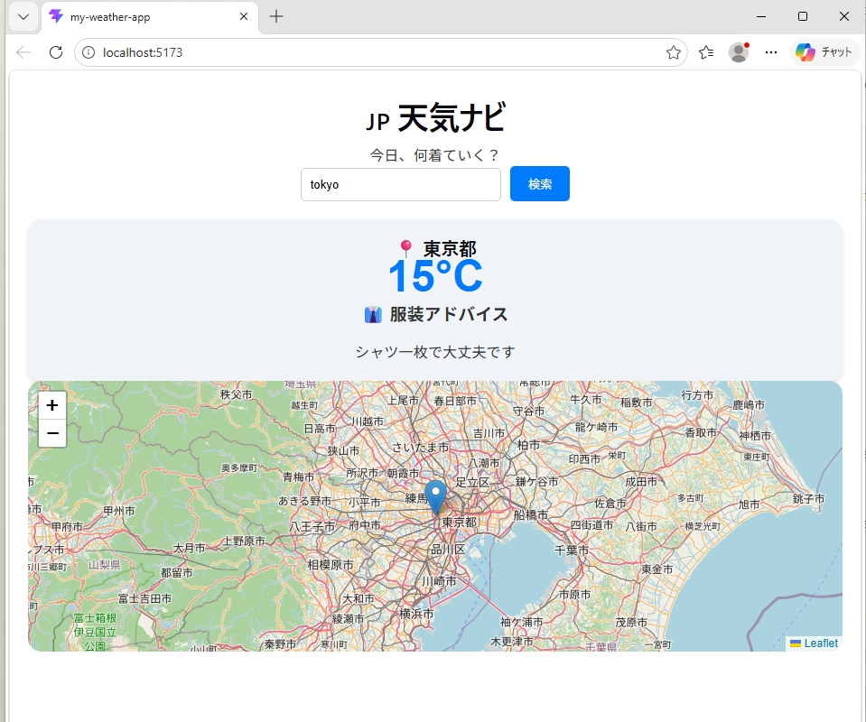

# 🇯🇵 天気ナビ (Weather Navi)

> **今日、何着ていく？** > 外出前の服装選びをサポートする、日本市場向けのパーソナル気象アシスタント。

---

## 🌏 言語 / Languages
- [日本語](#-日本語)
- [English](#-english)
- [中文](#-中文)

---

## 🇯🇵 日本語

### 概要
このプロジェクトは、日本で生活する人々や観光客が、その日の気温に合わせた最適な服装を即座に判断できるように設計されたReactアプリケーションです。OpenWeatherMap APIを利用し、リアルタイムの気象データを提供します。

### 主な機能
- **リアルタイム天気検索**: 都市名を英語（例: Tokyo, Nagoya）で入力して検索。
- **自動服装アドバイス**: 独自のアルゴリズムにより、気温に基づいた具体的な服装（コート、セーター、半袖など）を提案。
- **自動位置特定**: ブラウザのGeolocation APIを使用し、現在地の天気を即座に表示。
- **日本地図表示**: Leafletを使用したインタラクティブな地図で、検索場所を視覚的に確認。

---

## 🇺🇸 English

### Overview
**Weather Navi** is a React-based web application designed to help users in Japan decide what to wear based on real-time weather data. It aims to bridge the gap between abstract temperature numbers and practical daily life.

### Key Features
- **Real-time Weather Data**: Fetches up-to-date information via OpenWeatherMap API.
- **Smart Clothing Logic**: Provides tailored outfit suggestions (e.g., "Heavy coat needed" or "T-shirt is fine") based on the current temperature.
- **Geolocation Support**: Automatically detects and displays weather for the user's current location.
- **Interactive Map**: Displays the location on a dynamic Japan map using Leaflet.

---

## 🇨🇳 中文

### 项目简介
这是一个基于 React 开发的智能天气应用，专门针对日本市场设计。它不仅提供天气预报，更核心的功能是解决用户“今天穿什么”的实际痛点。

### 核心功能
- **实时数据查询**: 通过 OpenWeatherMap API 获取精准的天气信息。
- **智能穿衣建议**: 针对气温自动生成日语穿衣指南，适配日本本地生活习惯。
- **自动地理定位**: 一键获取当前所在位置的天气，无需手动输入。
- **动态地图展示**: 集成 Leaflet 地图，直观显示查询城市的位置。

---

## 🛠️ Tech Stack / 使用技術
- **Frontend**: React.js (Hooks)
- **Build Tool**: Vite
- **API**: OpenWeatherMap API
- **Maps**: Leaflet / React-Leaflet
- **HTTP Client**: Axios

---

## 🚀 How to Run / 起動方法
1. Clone the repository: `git clone [Your-Repo-URL]`
2. Install dependencies: `npm install`
3. Start the dev server: `npm run dev`
